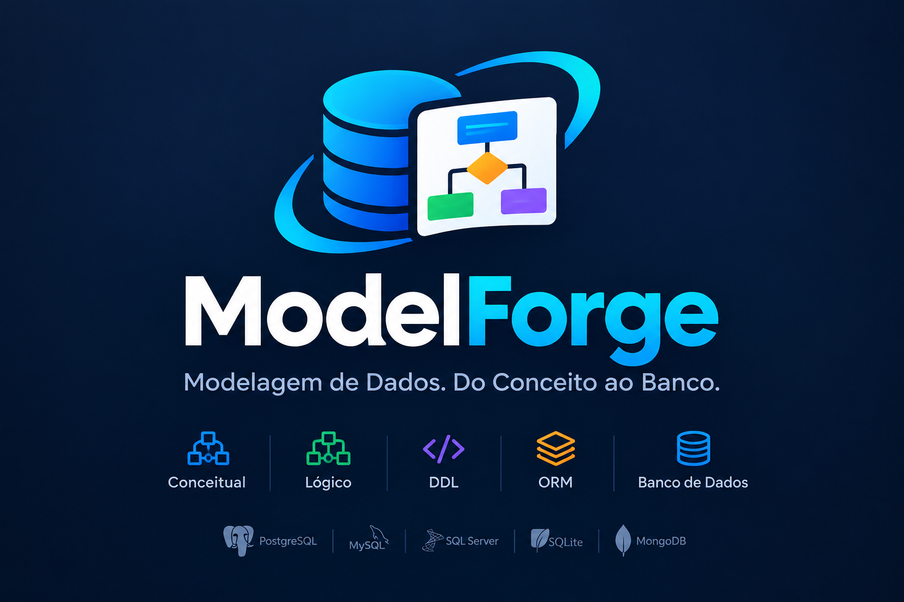

# ModelForge

[](LICENSE)



**Do conceito ao banco, no navegador.** O ModelForge é uma aplicação web para desenhar modelos de dados, converter entre
níveis de abstração e conversar com bancos reais, tudo na mesma tela. O front-end é **React + Vite**, o back-end é **NestJS**,
e os dois são escritos em TypeScript.

Autor: **Jairo dos Santos Gurgel** (jsgurgel@hotmail.com).

## O que ele faz

- **Desenha**: sete tipos de diagrama (Conceitual, Lógico, NoSQL, Fluxo, Atividade, EAP e Livre) em abas, com paleta de formas,
  Inspector de propriedades, guias de alinhamento, desfazer/refazer, zoom, minimapa e organização automática.
  Exporta para PNG, JPG, BMP, SVG e PDF.
- **Converte**: Conceitual ⇄ Lógico (com diálogos que deixam você decidir os casos ambíguos), e gera DDL, código ORM
  (JPA, SQLAlchemy, Prisma), documentação HTML e dicionário de dados. Também valida o modelo e importa DDL.
- **Conecta**: PostgreSQL, MySQL, SQL Server, SQLite e MongoDB. Importa a estrutura existente, arrasta tabelas para o
  diagrama, gera scripts de migração e executa SQL. O **SQL Studio** oferece abas de consulta, autocomplete pelo catálogo,
  histórico e exportação (CSV, JSON, SQL, Markdown, HTML). As senhas salvas são cifradas.
- **Automatiza**: uma CLI valida modelos e gera DDL/documentação sem abrir a interface, e o diagrama EAP tem um console de scripts.
- **Guarda**: arquivos JSON próprios (`.mfd.json` e pacote `.mfp.json`) ou salvamento no servidor. O acesso à API pode ser
  protegido por token.

A qualidade dos geradores, conversores e importadores é garantida por testes que comparam a saída com fixtures de referência
em `backend/test`.

### Como funciona a conversão Conceitual → Lógico

Quando o modelo tem pontos que admitem mais de uma solução (atributos multivalorados ou compostos, auto-relacionamento,
especialização, união, atributos de relacionamento, caracteres especiais), o front pergunta ao usuário. O protocolo é em duas fases
e o servidor não guarda estado:

1. O cliente envia `POST /api/geradores/converter/logico/interativo` com `{ diagrama, respostas }`, onde `respostas` são as
   escolhas já feitas, em ordem.
2. O servidor reexecuta a conversão, que é determinística. Se falta uma resposta, devolve `{ pendente: { indice, tipo, textos,
   opcoes, observacoes, padrao, desabilitadas } }`; se não falta, devolve `{ concluido: { diagrama, avisos, erros } }`.

Cada resposta é `{ "opcao": n }` ou `{ "todos": true }` (esta e as próximas perguntas assumem o padrão). Cancelar é
decisão do cliente. Os casos com respostas não padrão estão em `backend/test/fixtures-conceitual` (campo `variantes`).
Limitação: textos, desenhos e legendas do Conceitual não são copiados para o Lógico.

## Como rodar

Node **22.5+** (o suporte a SQLite usa `node:sqlite`; sem ele só a conexão SQLite fica indisponível). Docker usa Node 26.

```bash
# terminal 1
cd backend && npm install && npm run start:dev     # http://127.0.0.1:3000/api
# terminal 2
cd frontend && npm install && npm run dev          # http://localhost:5173 (o Vite repassa /api para :3000)
```

Testes: `npm test` em `backend/` (jest) e `npx vitest run` em `frontend/`; `npx tsc --noEmit -p .` em ambos.

## Variáveis de ambiente (backend)

| Variável | Padrão | Uso |
|---|---|---|
| `PORT` / `HOST` | `3000` / `127.0.0.1` (`0.0.0.0` no container) | onde o backend escuta |
| `FRONTEND_ORIGIN` | `http://localhost:5173` | origem aceita pelo CORS |
| `API_TOKEN` | vazio (sem autenticação) | quando definido, toda rota `/api` exige `Authorization: Bearer <token>`, exceto `GET /api/saude` |
| `DIAGRAMAS_FILE` | `backend/data/diagramas.json` | arquivo dos diagramas salvos no servidor |
| `CONEXOES_FILE` | `<dados>/conexoes.json` | arquivo das conexões salvas |
| `CONEXOES_KEY` / `CONEXOES_KEY_FILE` | chave gerada em `<dados>/conexoes.key` | chave que cifra senhas salvas (AES-256-GCM) |
| `BANCO_HOSTS_PERMITIDOS` | vazio = qualquer host | lista (vírgula) de hosts de banco permitidos; aceita `*.dominio.com` |
| `BANCO_SQLITE_DIR` | sem restrição | restringe arquivos SQLite a um diretório |
| `BANCO_TIMEOUT_CONEXAO_MS` / `BANCO_TIMEOUT_CONSULTA_MS` | `8000` / `30000` | limites de tempo |
| `BANCO_MAX_LINHAS` | `1000` (teto absoluto 10000) | linhas devolvidas por consulta |

No `docker compose`, `API_TOKEN`, `BANCO_HOSTS_PERMITIDOS`, `CONEXOES_KEY` e `FRONTEND_ORIGIN` vêm do arquivo `.env`
(modelo em [`.env.example`](.env.example)); `BACKEND_PORT` e `FRONTEND_PORT` mudam as portas publicadas.

## API

Prefixo `/api`. Corpos JSON (limite 20 MB). Erros de validação voltam como 400 com mensagem em português.

| Método | Rota | O que faz |
|---|---|---|
| GET | `/saude` | health check público; informa se a API exige token (`autenticacao`) |
| GET | `/diagramas` | lista (id, nome, tipo) |
| GET | `/diagramas/:id` | obtém um diagrama |
| POST | `/diagramas` | cria |
| PUT | `/diagramas/:id` | substitui |
| DELETE | `/diagramas/:id` | remove |
| GET | `/diagramas/:id/ddl` | DDL de um diagrama salvo |
| POST | `/geradores/ddl` | DDL do Lógico (corpo = diagrama) |
| POST | `/geradores/orm/:linguagem` | ORM (`jpa`, `sqlalchemy`, `prisma`) |
| POST | `/geradores/doc` | documentação HTML |
| POST | `/geradores/validar` | validação (Conceitual e Lógico) |
| POST | `/geradores/dsl/exportar` | Lógico → DSL de texto |
| POST | `/geradores/dsl/importar` | DSL → DDL (`{ dsl }`) |
| POST | `/geradores/importar/ddl` | DDL → Lógico (`{ ddl, nome? }`) |
| POST | `/geradores/importar/ddl-conceitual` | DDL → Conceitual |
| POST | `/geradores/converter/logico` | Conceitual → Lógico com as respostas padrão |
| POST | `/geradores/converter/logico/interativo` | Conceitual → Lógico com perguntas (duas fases) |
| POST | `/geradores/converter/conceitual` | Lógico → Conceitual |
| GET | `/bancos/tipos` | tipos de banco, limites e se há restrição de hosts |
| GET | `/bancos/conexoes` | conexões salvas (sem segredos) |
| POST | `/bancos/conexoes/sql` · `/bancos/conexoes/nosql` | salva conexão |
| DELETE | `/bancos/conexoes/:id` | remove conexão salva |
| POST | `/bancos/testar` · `/bancos/schemas` · `/bancos/objetos` · `/bancos/colunas` | explorar o catálogo |
| POST | `/bancos/catalogo` | catálogo completo (schemas, tabelas, colunas) para autocomplete, ex.: no SQL Studio |
| POST | `/bancos/detalhes` · `/bancos/objeto` | DDL de um objeto (e a forma pronta para soltar no diagrama) |
| POST | `/bancos/importar` | importa estrutura para Lógico/Conceitual |
| POST | `/bancos/migracao` | script de migração (diff diagrama × banco) |
| POST | `/bancos/executar` | executa SQL (exige `confirmar: true`) |
| POST | `/bancos/dados` | linhas de uma tabela, com filtro, ordenação e paginação |
| POST | `/bancos/dados/atualizar` · `/bancos/dados/excluir` · `/bancos/dados/inserir` · `/bancos/dados/duplicar` | CRUD de uma linha pela chave primária |
| POST | `/bancos/nosql/testar` · `/bancos/nosql/importar` · `/bancos/nosql/script` | MongoDB |

## Segurança e modelo de uso

O modelo é **monousuário e local**: o backend abre conexões de rede para o host que o usuário digitar, executa SQL e guarda as
conexões salvas num arquivo compartilhado por quem acessar a API. Sem `API_TOKEN` qualquer um que alcance a porta faz isso; o backend
registra um AVISO na inicialização. Para expor fora da máquina local:

1. defina `API_TOKEN` (ex.: `openssl rand -hex 32`); o front pede o token, guarda em `sessionStorage` e o envia em toda chamada
   (o nginx do container repassa o cabeçalho). A comparação é em tempo constante;
2. restrinja `BANCO_HOSTS_PERMITIDOS` (e `BANCO_SQLITE_DIR`) ao necessário;
3. publique atrás de HTTPS (o token viaja em cabeçalho); defina `CONEXOES_KEY` própria;
4. mantenha a porta do backend só em loopback/rede privada (o compose publica em `127.0.0.1`).

Não há contas nem separação entre usuários: quem tem o token enxerga todos os diagramas e conexões salvas.

## Docker

Imagens `node:26-alpine` (back, usuário não-root, health check em `/api/saude`) e nginx (front, que repassa `/api` ao back).

```bash
cp .env.example .env             # opcional: defina API_TOKEN etc.
docker compose up --build        # front em http://localhost:5173, back em http://127.0.0.1:3100
```

Os diagramas ficam no volume `diagramas` (sobrevivem a `restart`/`down`; `down -v` apaga). Cada imagem também sobe sozinha:

```bash
docker network create modelforge
docker build -t modelforge-back backend  && docker run -d --name backend --network modelforge -v modelforge-data:/app/data modelforge-back
docker build -t modelforge-front frontend && docker run -d --network modelforge -e BACKEND_URL=http://backend:3000 -p 5173:8080 modelforge-front
```

## Linha de comando

Valida o modelo e gera DDL ou documentação sem abrir a interface, offline, com o backend compilado:

```bash
(cd backend && npm install && npm run build)
node tools/cli/modelforge-cli.mjs --validar modelo.mfd.json               # lista problemas
node tools/cli/modelforge-cli.mjs --ddl modelo.mfd.json -o saida.sql       # DDL do Lógico (stdout sem -o)
node tools/cli/modelforge-cli.mjs --doc modelo.mfd.json -o modelo.html     # documentação HTML
node tools/cli/modelforge-cli.mjs --ajuda | --versao
```

Entradas: `.mfd.json`/`.json` (ou pacote `.mfp.json`, usa o primeiro diagrama).
Saída: `0` sucesso; `1` erro de uso ou leitura; `2` problemas de validação (em `--validar` e em `--ddl`, que gera o script mesmo
assim e lista os problemas no stderr). Código em `backend/src/cli`.

## Console de scripts do EAP

No diagrama EAP, o menu Diagrama > "Console de scripts do EAP (CLI)" abre um console para montar a estrutura por comandos:
`NOVO EAP HORIZONTAL|VERTICAL {…}`, `NOVO PROCESSO (x,y) {texto | GET(id)}`, `SET AMBIENT …`, `LISTAR`, `CLEAR` e `SAIR`.
Há blocos multilinha, Tab para completar, histórico e um assistente "Construtor". O interpretador está em
`frontend/src/editor/eapScript.ts`, com fixtures em `frontend/test/fixtures-cli`.

## Build estático, offline e empacotamento

- `cd frontend && npm run build` gera `frontend/dist` (estático). Ele precisa da API em `/api` (nginx do Docker, ou qualquer proxy
  reverso para o backend); não há modo 100% sem servidor porque conversões, geradores e bancos rodam no backend.
- Offline: com as dependências instaladas, front e back rodam sem internet (`npm run dev`, ou `npm run build` + `node backend/dist/main.js`
  servindo o `frontend/dist` por um proxy). A CLI acima funciona só com o backend compilado.
- Empacotamento nativo (instalador) não existe: use o Docker ou os dois processos Node.

## Licença

Licenciado sob a **GNU AGPL-3.0-or-later**; veja [LICENSE](LICENSE) e [NOTICE](NOTICE).
A atribuição de autoria ("Criado por Jairo dos Santos Gurgel" / "Baseado no ModelForge") deve ser mantida.
Quem modificar e disponibilizar o software, inclusive como serviço web, deve liberar o código-fonte das
modificações sob a mesma licença e indicar que a versão foi modificada.

## Contribuindo

Veja [CONTRIBUTING.md](CONTRIBUTING.md).
